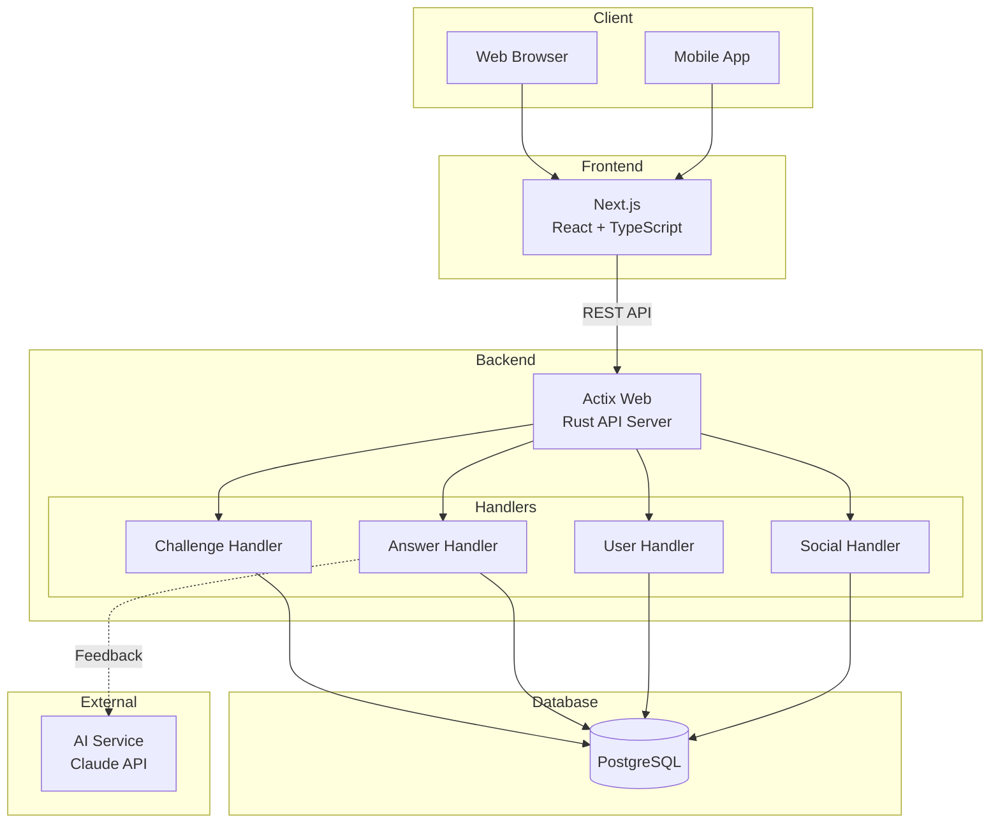
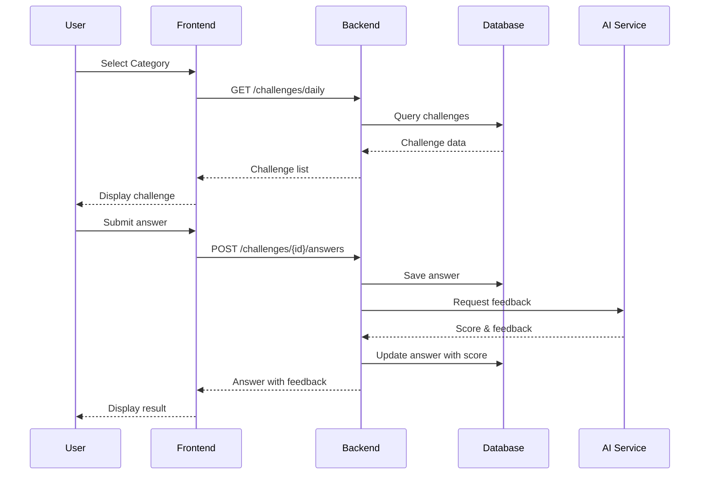

# Gengoka.app (Gengoka)

言語化力を鍛えるトレーニングアプリ

A training app to improve your ability to express thoughts in words.

## Overview

ゲンゴカは、限られた文字数で的確に表現する力を養うトレーニングアプリです。AIが出題するお題に対して、制限文字数内で回答し、フィードバックを受けることで言語化スキルを向上させます。

## Features

### Core Features
- **カテゴリー別トレーニング** - 5つのカテゴリーで言語化力を鍛える
  - 状況描写 (30文字)
  - 要約力 (50文字)
  - 感性の言語化 (30文字)
  - 言い換え (20文字)
  - 概念説明 (50文字)

- **AIフィードバック** - 回答に対するスコアと改善ポイント
- **文字数制限** - 限られた文字数で的確に表現する訓練

### SNS Features
- **タイムライン** - 他のユーザーの回答を閲覧
- **いいね** - 優れた回答に「いいね」
- **コメント** - 回答にコメント
- **フォロー** - ユーザーをフォロー
- **ランキング** - デイリー/ウィークリー/全期間のランキング

## Tech Stack

### Frontend (Web)
- Next.js
- TypeScript
- Tailwind CSS

### Mobile
- iOS (Swift / SwiftUI)
- Android (Kotlin / Jetpack Compose)

### Backend
- Rust
- Actix Web
- SQLx
- PostgreSQL

### Infrastructure
- Docker
- Docker Compose

## Architecture



### Data Flow




## Project Structure

```
gengoka/
├── doc/
│   ├── prompt.md          # Project requirements
│   └── ui/                 # UI Prototype (HTML)
└── sys/
    └── backend/
        ├── docker-compose.dev.yml
        └── app/
            ├── Cargo.toml
            ├── Dockerfile
            └── src/
                ├── main.rs
                ├── config/
                ├── db/
                ├── handlers/
                ├── middleware/
                ├── models/
                ├── routes/
                └── utils/
```

## Getting Started

### Prerequisites

- Docker & Docker Compose
- Rust (for local development)

### Run with Docker

```bash
cd sys/backend

# Start all services
docker-compose -f docker-compose.dev.yml up -d

# View logs
docker-compose -f docker-compose.dev.yml logs -f
```

### Services

| Service | URL | Description |
|---------|-----|-------------|
| Backend API | http://localhost:8080 | Rust API Server |
| Adminer | http://localhost:5050 | Database Admin UI |
| PostgreSQL | localhost:5432 | Database |

### Seed Data

```bash
docker exec -i gengoka-db psql -U gengoka -d gengoka_db < app/seeds/seed_data.sql
```

## Development

### Local Development (Rust)

```bash
cd sys/backend/app

# Copy environment file
cp .env.example .env

# Run
cargo run
```

### Database Migrations

Migrations run automatically on startup. Tables are created if they don't exist.

## License

MIT

## Author

Created with Claude Code
