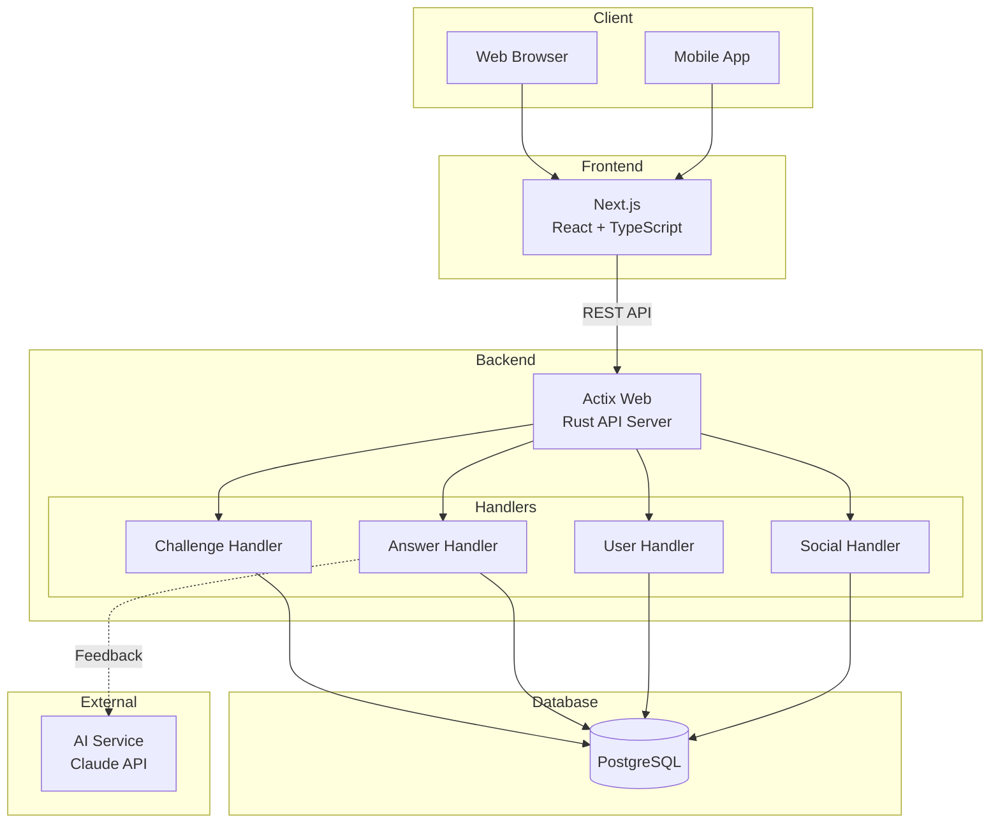
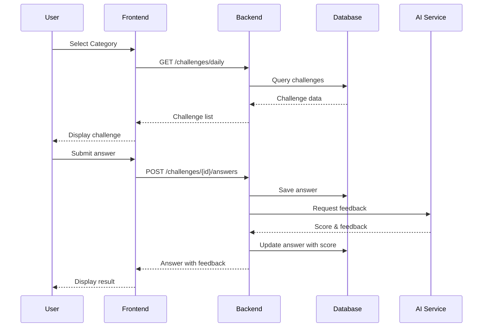
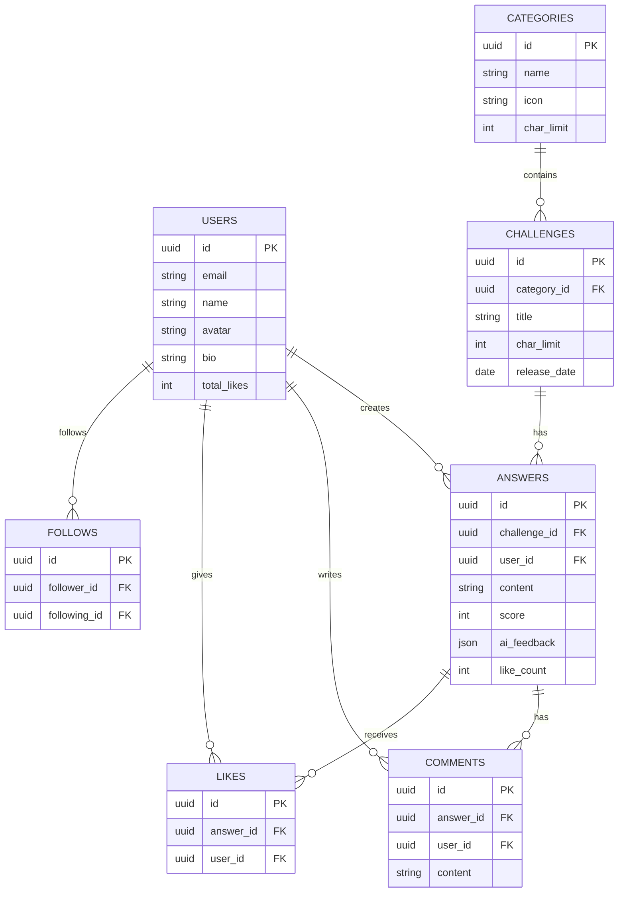

# Gengoka.app (Gengoka)

言語化力を鍛えるトレーニングアプリ

A training app to improve your ability to express thoughts in words.

## Overview

ゲンゴカは、限られた文字数で的確に表現する力を養うトレーニングアプリです。AIが出題するお題に対して、制限文字数内で回答し、フィードバックを受けることで言語化スキルを向上させます。

## Features

### Core Features
- **カテゴリー別トレーニング** - 5つのカテゴリーで言語化力を鍛える
  - 状況描写 (30文字)
  - 要約力 (50文字)
  - 感性の言語化 (30文字)
  - 言い換え (20文字)
  - 概念説明 (50文字)

- **AIフィードバック** - 回答に対するスコアと改善ポイント
- **文字数制限** - 限られた文字数で的確に表現する訓練

### SNS Features
- **タイムライン** - 他のユーザーの回答を閲覧
- **いいね** - 優れた回答に「いいね」
- **コメント** - 回答にコメント
- **フォロー** - ユーザーをフォロー
- **ランキング** - デイリー/ウィークリー/全期間のランキング

## Tech Stack

### Frontend
- Next.js
- TypeScript
- Tailwind CSS

### Backend
- Rust
- Actix Web
- SQLx
- PostgreSQL

### Infrastructure
- Docker
- Docker Compose

## Architecture



### Data Flow



### Database Schema



## Project Structure

```
gengoka/
├── doc/
│   ├── prompt.md          # Project requirements
│   └── ui/                 # UI Prototype (HTML)
└── sys/
    └── backend/
        ├── docker-compose.dev.yml
        └── app/
            ├── Cargo.toml
            ├── Dockerfile
            └── src/
                ├── main.rs
                ├── config/
                ├── db/
                ├── handlers/
                ├── middleware/
                ├── models/
                ├── routes/
                └── utils/
```

## Getting Started

### Prerequisites

- Docker & Docker Compose
- Rust (for local development)

### Run with Docker

```bash
cd sys/backend

# Start all services
docker-compose -f docker-compose.dev.yml up -d

# View logs
docker-compose -f docker-compose.dev.yml logs -f
```

### Services

| Service | URL | Description |
|---------|-----|-------------|
| Backend API | http://localhost:8080 | Rust API Server |
| Adminer | http://localhost:5050 | Database Admin UI |
| PostgreSQL | localhost:5432 | Database |

### Seed Data

```bash
docker exec -i gengoka-db psql -U gengoka -d gengoka_db < app/seeds/seed_data.sql
```

## API Endpoints

### Health
| Method | Endpoint | Description |
|--------|----------|-------------|
| GET | `/health` | Health check |

### Categories
| Method | Endpoint | Description |
|--------|----------|-------------|
| GET | `/api/v1/categories` | List all categories |
| GET | `/api/v1/categories/{id}` | Get category |
| GET | `/api/v1/categories/{id}/challenges` | Get challenges by category |

### Challenges (お題)
| Method | Endpoint | Description |
|--------|----------|-------------|
| GET | `/api/v1/challenges` | List challenges |
| GET | `/api/v1/challenges/daily` | Get daily challenges |
| GET | `/api/v1/challenges/{id}` | Get challenge |
| POST | `/api/v1/challenges` | Create challenge |
| GET | `/api/v1/challenges/{id}/answers` | Get answers for challenge |
| POST | `/api/v1/challenges/{id}/answers` | Submit answer |

### Answers (回答)
| Method | Endpoint | Description |
|--------|----------|-------------|
| GET | `/api/v1/answers/{id}` | Get answer |
| PUT | `/api/v1/answers/{id}` | Update answer |
| DELETE | `/api/v1/answers/{id}` | Delete answer |
| POST | `/api/v1/answers/{id}/like` | Like answer |
| DELETE | `/api/v1/answers/{id}/like` | Unlike answer |
| GET | `/api/v1/answers/{id}/comments` | Get comments |
| POST | `/api/v1/answers/{id}/comments` | Add comment |

### Users
| Method | Endpoint | Description |
|--------|----------|-------------|
| POST | `/api/v1/users` | Create user |
| GET | `/api/v1/users/{id}` | Get user profile |
| PUT | `/api/v1/users/{id}` | Update profile |
| GET | `/api/v1/users/{id}/answers` | Get user's answers |
| POST | `/api/v1/users/{id}/follow` | Follow user |
| DELETE | `/api/v1/users/{id}/follow` | Unfollow user |
| GET | `/api/v1/users/{id}/followers` | Get followers |
| GET | `/api/v1/users/{id}/following` | Get following |

### Feed & Rankings
| Method | Endpoint | Description |
|--------|----------|-------------|
| GET | `/api/v1/feed` | Timeline feed |
| GET | `/api/v1/trending` | Trending answers |
| GET | `/api/v1/rankings/daily` | Daily ranking |
| GET | `/api/v1/rankings/weekly` | Weekly ranking |
| GET | `/api/v1/rankings/all-time` | All-time ranking |

## Authentication

User identification is done via `X-User-ID` header:

```bash
curl -H "X-User-ID: aaaa1111-1111-1111-1111-111111111111" \
  http://localhost:8080/api/v1/answers/xxx/like -X POST
```

## Environment Variables

```bash
# Server
SERVER_PORT=8080
SERVER_HOST=0.0.0.0
RUST_LOG=info

# Database
DB_HOST=localhost
DB_PORT=5432
DB_USER=gengoka
DB_PASSWORD=gengoka_password
DB_NAME=gengoka_db
DB_MAX_CONNECTIONS=10

# Pagination
DEFAULT_PAGE_SIZE=20
MAX_PAGE_SIZE=100
```

## Development

### Local Development (Rust)

```bash
cd sys/backend/app

# Copy environment file
cp .env.example .env

# Run
cargo run
```

### Database Migrations

Migrations run automatically on startup. Tables are created if they don't exist.

## License

MIT

## Author

Created with Claude Code
