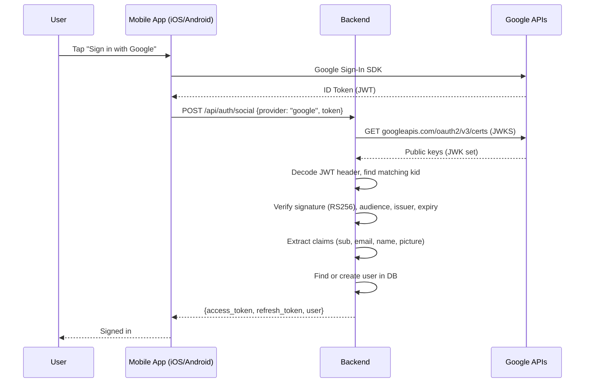
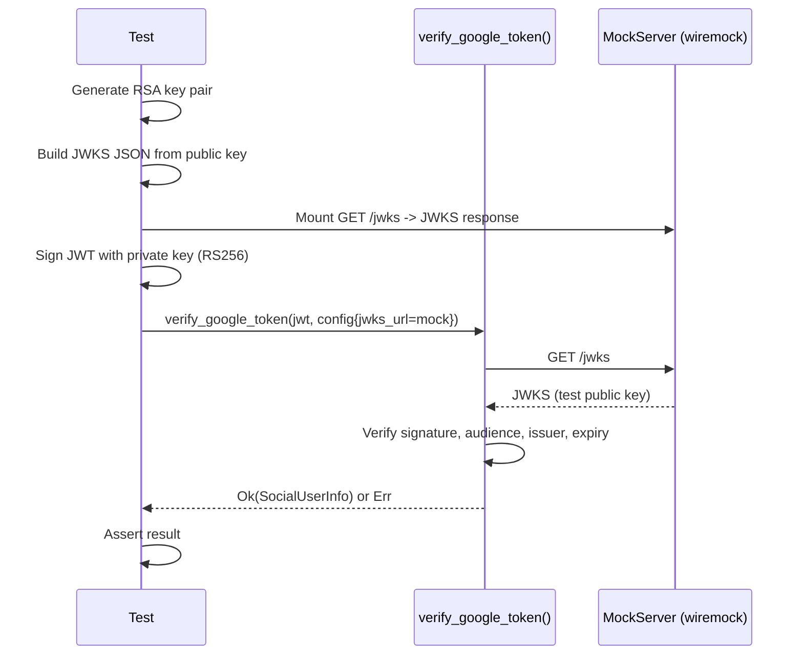
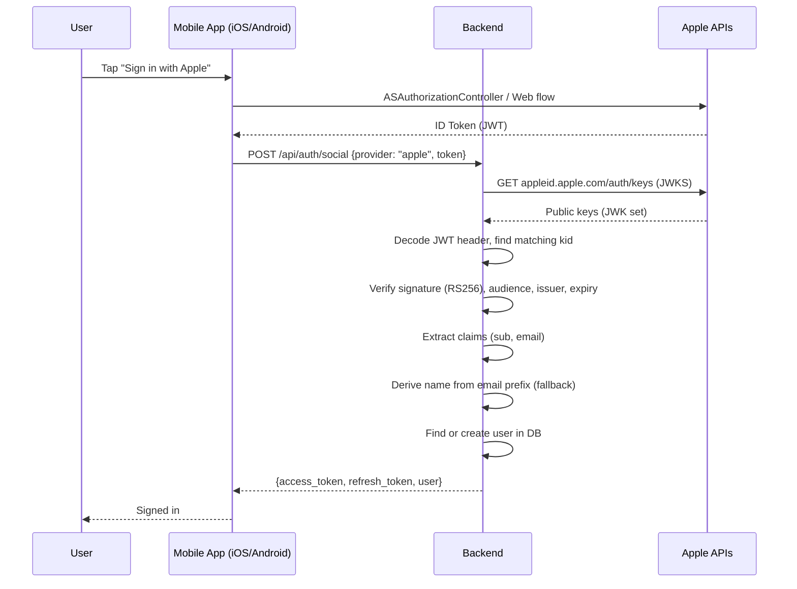
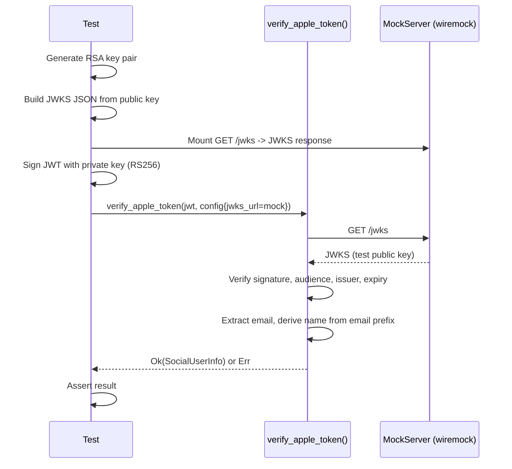
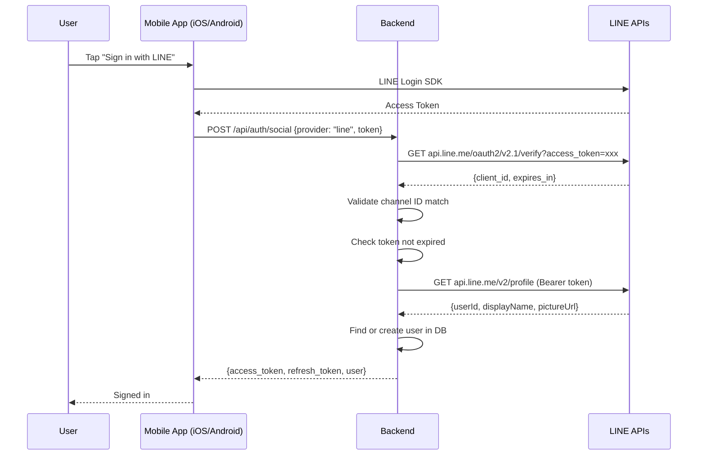
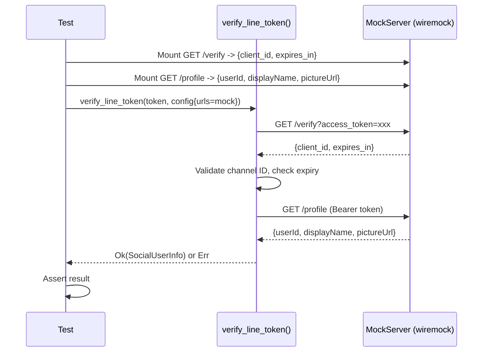
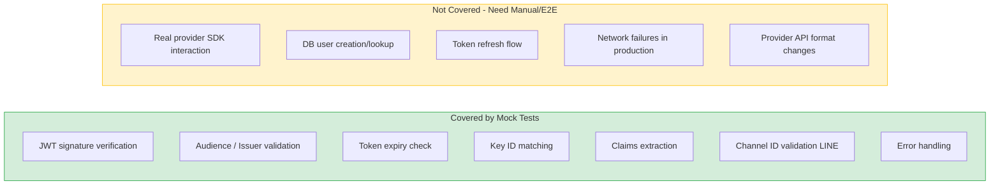

# Phase 1: Social Authentication Flow

## Google Sign-In

### Real Flow (Production)

### Test Flow (Mock)

---

## Apple Sign-In

### Real Flow (Production)

### Test Flow (Mock)

---

## LINE Sign-In

### Real Flow (Production)

### Test Flow (Mock)

---

## What Tests Cover vs What They Don't

